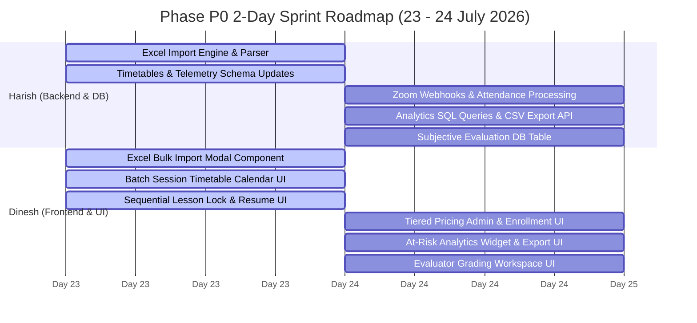

# 🚀 Wysbryx LMS — Master 3-Phase Sprint & Work Breakdown Plan

**Project:** Learning Management System (LMS)  
**Document Type:** 3-Phase Sprint Execution Plan  
**Target Phase P0 Completion Date:** Day After Tomorrow (24 July 2026)  
**Phase P0 Assigned Engineers:** Harish & Dinesh  

---

## 1. High-Level Sprint Allocation Matrix

| Phase | Scope / Focus | Assigned Resource(s) | Timeline / Target | Execution Status |
|:---|:---|:---|:---|:---|
| **Phase P0** | 8 Core LMS Modules (Excel Import, Timetables, Zoom Webhooks, Telemetry, At-Risk Analytics, Subjective Evaluation, Lesson Locking, Tiered Pricing) | **Harish** & **Dinesh** | **2 Days** • Day 1: Tomorrow (23 July) • Day 2: Day After Tomorrow (24 July) | 🟢 **Starting Tomorrow** |
| **Phase P1** | 4 AI Modules (Chat Bot, Book Bot, Analytics Bot, Concept Bot) | *Yet to be discussed* | *Yet to be discussed* | ⏳ Pending Discussion |
| **Phase P2** | 4 Ecosystem Modules (Solution Lab, Mentorship, Japanese Learning, Japanese OCR) | *Yet to be discussed* | *Yet to be discussed* | ⏳ Pending Discussion |

---

## 2. Phase P0: 2-Day Execution Plan (Harish & Dinesh)

Phase P0 deliverables are divided into a **Backend & Schema Stream (Harish)** and a **Frontend Consoles & UI Stream (Dinesh)** to ensure zero blocking dependencies.

---

### 👨‍💻 HARISH — Backend & Database Lead

#### 📅 Day 1 (Tomorrow — 23 July 2026)
1. **Excel Bulk Import Engine (Backend)**
   - Create `ExcelImportService.ts` to parse `.xlsx` and `.csv` files.
   - Implement user account generation, password hashing, and batch roster insertion.
   - Build server action for bulk student ingestion with error handling for duplicate emails/malformed rows.
2. **Batch Session Timetables Schema**
   - Create `batch_sessions` table (`id`, `batchId`, `title`, `date`, `startTime`, `endTime`, `zoomMeetingId`, `zoomJoinUrl`).
   - Create `batch_instructors` join table and add `status` enum (`upcoming`, `ongoing`, `completed`, `cancelled`) to `batches`.
3. **Telemetry & Tracking Schema Upgrade**
   - Expand `lessonProgress` table in `schema.ts` with `videoResumeOffsetSeconds`, `videoMaxWatchedPercent`, `totalTimeSpentSeconds`, and `zoomAttendanceLogs` (`jsonb`).
4. **Tiered Pricing Database Schema**
   - Create `pricing_tiers` table (`id`, `courseId`, `batchId`, `level`, `basePrice`, `currency`, `features`) linked to `courses` and `batches`.

#### 📅 Day 2 (Day After Tomorrow — 24 July 2026)
1. **Zoom Webhook Attendance & Recording Sync**
   - Implement handler in `/api/webhooks/zoom` to catch `meeting.participant_joined` and `meeting.participant_left`.
   - Compute join/leave duration and write logs to `lessonProgress.zoomAttendanceLogs`.
   - Auto-sync Zoom cloud recording URLs back to lesson items.
2. **At-Risk Analytics SQL Engine & CSV Exporter**
   - Write optimized queries flagging students with no activity for $>7$ days or average quiz scores $<50\%$.
   - Build `/api/analytics/export-csv` route returning batch progress reports.
3. **Subjective Assessment Data Engine**
   - Create `subjective_submissions` schema (`id`, `studentId`, `lessonId`, `evaluatorId`, `content`, `attachmentUrl`, `marks`, `feedback`, `status`).

---

### 👨‍💻 DINESH — Frontend Consoles & User Experience Lead

#### 📅 Day 1 (Tomorrow — 23 July 2026)
1. **Excel Upload Component (`<ExcelUploadModal />`)**
   - Build drag-and-drop modal UI for `.xlsx`/`.csv` files with live table preview.
   - Hook up modal to Harish's bulk import server action with toast alerts and error reporting.
2. **Batch Timetable Calendar UI**
   - Build interactive session calendar widget for Admin, Faculty, and Student dashboards.
   - Display upcoming live Zoom classes with a direct "Join Session" launch button.
3. **Sequential Lesson Unlocking & Resume Position UI**
   - Build lesson lock enforcement on course syllabus view (Sequential locking for Beginner, Free Navigation for Advanced).
   - Add "Resume Course" floating banner linking directly to student's last visited `lessonId`.

#### 📅 Day 2 (Day After Tomorrow — 24 July 2026)
1. **Tiered Pricing UI & Selection Flow**
   - Build Pricing Tier Manager in `CourseManagerConsole.tsx` allowing admins to set prices per competency level (Beginner/Intermediate/Advanced).
   - Update student enrollment modal to allow selecting competency level and pricing tier.
2. **At-Risk Student Dashboard Widget**
   - Build "At-Risk Students" table widget in Admin/Faculty analytics view.
   - Add "Export CSV Report" button connected to `/api/analytics/export-csv`.
3. **Evaluator Review Workspace**
   - Build Evaluator Portal UI for subjective assignment grading.
   - Include submission text viewer, document preview, rubric score inputs, feedback box, and "Publish Grade" trigger.

---

## 3. Phase P1: AI Deliverables

| Module | Timeline | Assigned Resource | High-Level Scope |
|:---|:---|:---|:---|
| **1. Chat Bot** | *Yet to be discussed* | *Yet to be discussed* | OpenAI API + RAG over course syllabus & materials, embedded `<ChatBotWidget />`, searchable chat history, instructor escalation. |
| **2. Book Bot** | *Yet to be discussed* | *Yet to be discussed* | In-house local LLM (Ollama/vLLM) knowledge engine indexing Digital Library documents for semantic retrieval. |
| **3. Analytics Bot** | *Yet to be discussed* | *Yet to be discussed* | AI weak-topic identification, progress trend forecasting, and targeted remedial content recommendations. |
| **4. Concept Bot** | *Yet to be discussed* | *Yet to be discussed* | Prerequisite concept mapping (`concept_graph`), learning gap identification, and personalized study plan generation. |

---

## 4. Phase P2: Ecosystem & Specialized Modules

| Module | Timeline | Assigned Resource | High-Level Scope |
|:---|:---|:---|:---|
| **1. Internship & Solution Lab** | *Yet to be discussed* | *Yet to be discussed* | Ecosystem hubs (Learning COE, HighFi COE, Learning/Challenge/Experiment Labs) & Solution Lab research paper/project publication showcase portal. |
| **2. Mentorship Module** | *Yet to be discussed* | *Yet to be discussed* | Restricted mentor access, student request flow, mentor profiles, activity assignments (books/assessments), and direct messaging / discussion boards. |
| **3. Japanese Learning Module** | *Yet to be discussed* | *Yet to be discussed* | Vocabulary database, Hiragana/Katakana/Kanji stroke-order canvas, vocabulary assessments, and audio pronunciation evaluator. |
| **4. Japanese Textbook OCR** | *Yet to be discussed* | *Yet to be discussed* | OCR engine integration (Tesseract / Vision API) converting printed Japanese textbooks into searchable content for Digital Library & Book Bot. |
